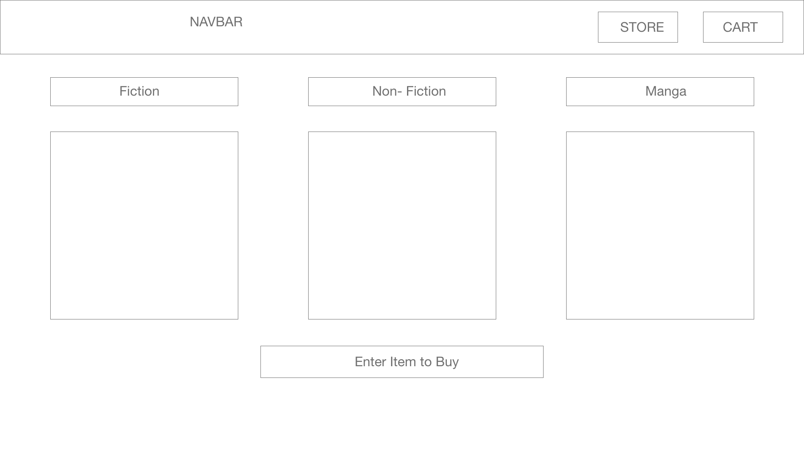
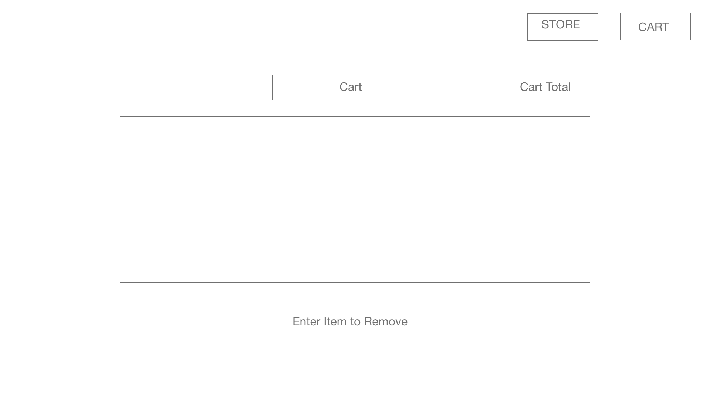

#Capstone Project Proposal
---
##Book Store

###Description:
 Bookstore react application the features a form field an 3 pre-populated tables that display the item information stored in the back end sql DB. The user will enter a item in the form field, if valid, the price will be generated and added to the all the items the user has enter into the form field. The items will be stored inside a cart table in the back in db. The user will also be able to view and delete the items stored in the cart table.

###Technical Requirements: 
The application will use a springboot application connected to a sql DB to store applicaition information for the backend. The front-end will use react and react router.

###Wireframe:

